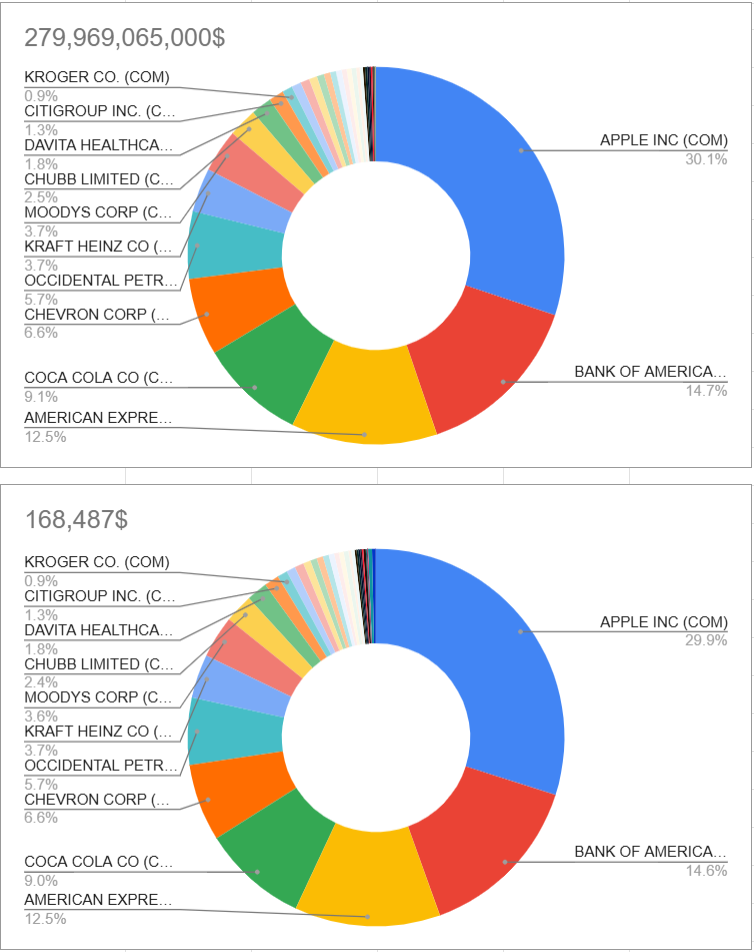

# portfolio-reducer
## <b>Overview</b>
A tool to minimize stock quantities while maintaining the desired allocation of a high-value portfolio.
---
## Main features
- <b>Minimize Stock Quantities:</b> Calculate the lowest possible quantities of stocks.
- <b>Maintain Allocation:</b> Ensure the portfolio’s desired allocation is preserved.



## Usage
1. Run the main script:
   ```python portfolioReducer.py```;
2. Follow the on-screen instructions;

## To-do
- [ ] Improve algorithm
- [ ] Make data input easier

## To-do (if I'm bored with life)
- [ ] Link the script with a sample Excel sheet
- [ ] Input the data automatically from specific columns in the table
- [ ] Output the data automatically in the table
- [ ] Automate ticker price retrieval
